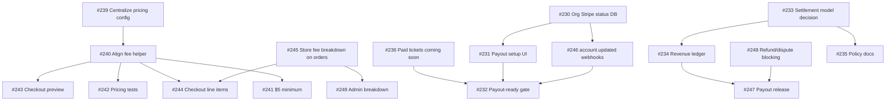

# VIZB GitHub Issue Roadmap — Payments & Stripe

**Last updated:** June 16, 2026  
**Repo:** [Digital-Builders-757/ViZb](https://github.com/Digital-Builders-757/ViZb)  
**Reference:** [payment-system-audit.md](./payment-system-audit.md)

This document records the payment/ticketing issue cleanup: duplicates identified, milestones created, canonical issues mapped, and recommended merges/closures (none closed without explicit approval).

---

## Executive summary

GitHub CLI was available and authenticated. The repo had **one open payment epic cluster** (#229–#236) plus **closed** Stripe/ticketing history (#110, #124–#128, #176, #180, etc.). There were **no pre-existing open issues** for launch fee alignment, processing-fee passthrough, or webhook refund/dispute work.

**Actions taken:**

- Created **19 area/priority/type labels**
- Created **milestones M1–M6**
- Labeled and milestone-assigned **#229–#236**
- Created **11 new canonical issues #239–#249**
- Renamed **#235** to match canonical policy title

**Not closed:** No issues were closed (per rules — recommend only).

---

## Milestones

| Milestone | Scope |
|-----------|--------|
| [M1 — Fee System Fix](https://github.com/Digital-Builders-757/ViZb/milestone/1) | 5% + $1/ticket, $5 min, pricing config, tests |
| [M2 — Checkout + Stripe Receipt Alignment](https://github.com/Digital-Builders-757/ViZb/milestone/2) | Buyer breakdown, Checkout line items, order fee columns |
| [M3 — Stripe Connect Organizer Onboarding](https://github.com/Digital-Builders-757/ViZb/milestone/3) | Express onboarding, org Stripe status, payout-ready gating |
| [M4 — Organizer Payout Engine](https://github.com/Digital-Builders-757/ViZb/milestone/4) | Ledger, settlement model, payout release |
| [M5 — Refunds, Disputes, and Risk Controls](https://github.com/Digital-Builders-757/ViZb/milestone/5) | Webhook blocking, admin breakdown, ops |
| [M6 — Business Pricing + Documentation](https://github.com/Digital-Builders-757/ViZb/milestone/6) | Public policy, pricing docs |

---

## Canonical roadmap (final)

### M1 — Fee System Fix

| Issue | Title | Status |
|-------|-------|--------|
| [#236](https://github.com/Digital-Builders-757/ViZb/issues/236) | P0: Make organizer paid tickets coming soon | **Existing** — gate before Connect |
| [#239](https://github.com/Digital-Builders-757/ViZb/issues/239) | Centralize VIZB pricing config | **Created** |
| [#240](https://github.com/Digital-Builders-757/ViZb/issues/240) | Align shared fee calculation helper with launch fee model | **Created** (helper exists; align defaults) |
| [#241](https://github.com/Digital-Builders-757/ViZb/issues/241) | Enforce $5 minimum paid ticket rule | **Created** |
| [#242](https://github.com/Digital-Builders-757/ViZb/issues/242) | Add pricing calculation tests | **Created** |

### M2 — Checkout + Stripe Receipt Alignment

| Issue | Title | Status |
|-------|-------|--------|
| [#243](https://github.com/Digital-Builders-757/ViZb/issues/243) | Update checkout preview fee breakdown | **Created** |
| [#244](https://github.com/Digital-Builders-757/ViZb/issues/244) | Align Stripe Checkout line items with VIZB fee model | **Created** |
| [#245](https://github.com/Digital-Builders-757/ViZb/issues/245) | Store full fee breakdown on orders | **Created** |

### M3 — Stripe Connect Organizer Onboarding

| Issue | Title | Status |
|-------|-------|--------|
| [#230](https://github.com/Digital-Builders-757/ViZb/issues/230) | Add organizer payout setup status to organizations | **Existing** — DB half of Connect onboarding |
| [#231](https://github.com/Digital-Builders-757/ViZb/issues/231) | Build payout setup UI for organizer dashboard | **Existing** — UI half of Connect onboarding |
| [#232](https://github.com/Digital-Builders-757/ViZb/issues/232) | Require payout readiness before paid organizer events | **Existing** = canonical “Block paid ticket sales until payout-ready” |
| [#246](https://github.com/Digital-Builders-757/ViZb/issues/246) | Sync organizer Stripe account status from webhooks | **Created** |

**Canonical alias:** “Build Stripe Connect Express organizer onboarding” → **#230 + #231** (do not open a third issue).

### M4 — Organizer Payout Engine

| Issue | Title | Status |
|-------|-------|--------|
| [#233](https://github.com/Digital-Builders-757/ViZb/issues/233) | Choose checkout settlement model for paid organizer events | **Existing** — decision blocker |
| [#234](https://github.com/Digital-Builders-757/ViZb/issues/234) | Add paid organizer revenue ledger | **Existing** = canonical “Create payout records after successful payments” |
| [#247](https://github.com/Digital-Builders-757/ViZb/issues/247) | Add payout release function for organizers | **Created** |

### M5 — Refunds, Disputes, and Risk Controls

| Issue | Title | Status |
|-------|-------|--------|
| [#248](https://github.com/Digital-Builders-757/ViZb/issues/248) | Add refund and dispute payout blocking | **Created** — verify/deploy webhook hardening in repo |
| [#249](https://github.com/Digital-Builders-757/ViZb/issues/249) | Add admin order and payout breakdown view | **Created** — extends closed #126 |

### M6 — Business Pricing + Documentation

| Issue | Title | Status |
|-------|-------|--------|
| [#235](https://github.com/Digital-Builders-757/ViZb/issues/235) | Document VIZB pricing, refunds, and payout policy | **Existing** — renamed |

### Epic (parent)

| Issue | Title |
|-------|-------|
| [#229](https://github.com/Digital-Builders-757/ViZb/issues/229) | Epic: Build organizer payouts with Stripe Connect |

---

## Duplicate / overlap analysis

### Open issues — merge map (do not duplicate)

| Canonical intent | Keep | Overlap / action |
|------------------|------|-------------------|
| Build Stripe Connect Express organizer onboarding | **#230**, **#231** | Single epic split; do not create duplicate |
| Block paid ticket sales until payout-ready | **#232** | Matches canonical; add cross-links to #246 |
| Create payout records after successful payments | **#234** | Matches ledger issue; link #247 release |
| Document pricing/refunds/payout policy | **#235** | Renamed to canonical title |
| Organizer paid ticket gate (pre-Connect) | **#236** | Unique P0; stays in M1 |

### Closed issues — historical (do not reopen)

| Closed | Title | Notes |
|--------|-------|-------|
| #110 | Build Stripe-powered ticketing revenue system | Superseded by current MVP + Connect epic |
| #124–#128, #176, #180 | Checkout fulfillment, tests, admin revenue | Done; extend via #242, #249 not reopen |
| #175 / #189 | Paid tier not on public page | Duplicate pair; both closed |

**Recommendation:** If anyone opens new issues matching closed titles, comment with link to closed issue + new canonical (#239–#249).

---

## Issues recommended to close or merge (approval required)

| Issue | Recommendation | Reason |
|-------|--------------|--------|
| None immediately | — | Open payment issues are distinct epic children or new canonical work |

**Future consideration (not executed):**

- When #230 and #231 both close, consider closing #229 epic or converting to tracking issue only.
- Do **not** reopen #110; reference #229 instead.

---

## Labels created

```
priority: critical | high | medium | low
type: bug | feature | refactor | docs | test
area: pricing | checkout | stripe | connect | webhooks | payouts | database | organizers | admin | docs
```

Legacy labels (`payments`, `stripe`, `P0`, etc.) remain for backward compatibility on older issues.

---

## Dependency graph (recommended order)



---

## Issues created or updated (this cleanup)

### Created (#239–#249)

1. #239 — Centralize VIZB pricing config  
2. #240 — Align shared fee calculation helper with launch fee model  
3. #241 — Enforce $5 minimum paid ticket rule  
4. #242 — Add pricing calculation tests  
5. #243 — Update checkout preview fee breakdown  
6. #244 — Align Stripe Checkout line items with VIZB fee model  
7. #245 — Store full fee breakdown on orders  
8. #246 — Sync organizer Stripe account status from webhooks  
9. #247 — Add payout release function for organizers  
10. #248 — Add refund and dispute payout blocking  
11. #249 — Add admin order and payout breakdown view  

### Updated (existing)

| Issue | Change |
|-------|--------|
| #229 | Labels + roadmap comment |
| #230–#234, #236 | Milestone + labels assigned |
| #235 | Renamed to canonical policy title; M6 + labels |

---

## Launch fee model checklist (issue coverage)

| Rule | Covered by |
|------|------------|
| 5% + $1/ticket | #239, #240, #242 |
| Processing fee to buyer | #244, #245 (needs product decision on estimate vs dynamic) |
| Organizer payout = face value | #233, #234, #247 |
| $5 minimum ticket | #241 |
| Free = RSVP only | #236, #232 (gate paid organizer tiers) |
| Refunds/disputes block payout | #248, #235 |

---

## Next steps for maintainers

1. **Confirm** before closing any issue — none were auto-closed.
2. **Link PRs** to canonical issue numbers (#239–#249), not duplicate titles.
3. **Apply migration** `20260616130259_stripe_webhook_hardening.sql` before closing #248.
4. **Resolve #233** (settlement model) before M4 checkout rewrite.
5. Update epic **#229** body when milestones complete to reflect M1–M6 structure.

---

## Tooling

Issue creation script (optional rerun): `scripts/create-payment-roadmap-issues.mjs` — idempotent only if titles unchanged (will create duplicates if re-run; use GitHub search first).
