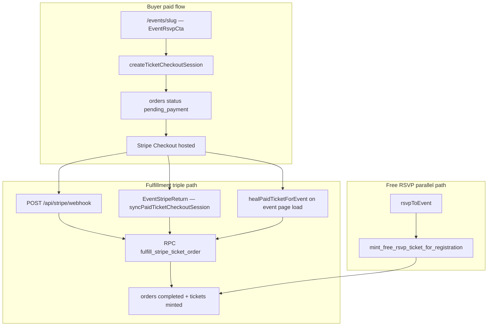

# VIZB Payment System Audit

**Last updated:** June 16, 2026  
**Scope:** Read-only audit of ticketing, checkout, Stripe integration, and organizer payment architecture.  
**Operator:** ViBE LLC · **Domain:** vizbva.com  
**Status:** No payment behavior was changed as part of this audit.

---

## Executive summary

VIZB has a **working MVP paid-ticketing stack** built on **Stripe Checkout (hosted, mode `payment`)** with money collected on the **platform Stripe account** (ViBE LLC). Free events use an RSVP path that mints tickets without Stripe.

The system is **not yet a marketplace**. There is **no Stripe Connect**, **no organizer payout logic**, and **no buyer-facing Stripe processing-fee passthrough**. Platform fees are calculated in one module and stored on `orders`; fulfillment is webhook-primary with two client-side fallbacks.

This document is the **master payment map** for reorganizing GitHub issues and sequencing work toward the official launch fee model and Stripe Connect Express.

### Architecture at a glance



### Payment model today

| Party | Receives / pays |
|-------|-----------------|
| **Buyer** | Ticket face value (`subtotal_cents`) + ViZb platform fee (`platform_fee_cents`) |
| **ViBE LLC (platform)** | Full charge on platform Stripe account; platform fee is a separate Checkout line item |
| **Organizer** | Nothing automatically — no transfers, balances, or payout UI |
| **Stripe processing** | Not modeled in app; admin revenue panel excludes card processing fees |

---

## Official launch fee model vs current code

| Launch requirement | Current state | Gap severity | Primary location |
|--------------------|---------------|--------------|------------------|
| VIZB service fee = **5%** of ticket subtotal | **Implemented** — default 5% (`VIZB_PLATFORM_FEE_BPS = 500`) | None | `lib/payments/ticket-fees.ts` |
| **+$1.00 per paid ticket** | **Missing** — fixed fee defaults to **0¢**; env `TICKET_PLATFORM_FEE_FIXED_CENTS` exists but is not set to `100` | High | `lib/payments/ticket-fees.ts`, `.env.example` |
| **Processing fee passed to buyer** | **Missing** — no third line item, no Stripe fee estimate | High | `app/actions/ticket-checkout.ts` |
| **Organizer payout = ticket face value** | **Missing** — no Connect, no transfers | Critical | No Connect code in repo |
| **Minimum paid ticket = $5.00** | **Mismatch** — enforced at **$0.50** (Stripe USD floor comment) | High | `lib/tickets/paid-tier-validation.ts` |
| **Free events = RSVP only, no Stripe** | **Aligned** — checkout rejects `price < 1`; free path uses RSVP RPC | None | `app/actions/ticket-checkout.ts`, `app/actions/registrations.ts` |

---

## End-to-end flows

### Paid ticket purchase (web)

1. User opens **`/events/[slug]`** — `app/events/[slug]/page.tsx` loads tiers via `loadPublicTicketTiersForEvent`, checks Stripe env keys, renders `EventRsvpCta`.
2. User selects a paid tier and clicks **Buy ticket** — `components/events/event-rsvp-cta.tsx` calls server action `createTicketCheckoutSession`.
3. **Auth gate** — unsigned users redirect to login; `PostLoginIntentResolver` can scroll back to `#event-rsvp`.
4. **`createTicketCheckoutSession`** (`app/actions/ticket-checkout.ts`) validates tier, event, capacity, duplicate ticket, USD currency; computes fees; inserts `orders` + `order_items` (`pending_payment`); creates Stripe Checkout Session with metadata (`order_id`, `user_id`, `event_id`, `ticket_type_id`).
5. Browser redirects to **Stripe hosted checkout**.
6. On success: return to `/events/{slug}?session_id={CHECKOUT_SESSION_ID}`.
7. **`EventStripeReturn`** calls `syncPaidTicketCheckoutSession` if webhook lagged.
8. **`healPaidTicketForEvent`** runs on event page load for signed-in users with a recent paid session (webhook miss recovery).
9. Fulfillment RPC **`fulfill_stripe_ticket_order`** marks order `completed`, mints `tickets` + `event_registrations`.
10. User opens wallet at **`/dashboard/tickets`** or **`/tickets`**.

### Paid ticket purchase (mobile API)

- **`POST /api/stripe/checkout/[eventId]`** — `app/api/stripe/checkout/[eventId]/route.ts`
- Bearer auth; passes authenticated user into `createTicketCheckoutSession(..., { id, email })` so service-role client is used instead of cookie session.

### Free RSVP

1. Same event page; **RSVP free** → `rsvpToEvent` (`app/actions/registrations.ts`).
2. Upserts `event_registrations` → `mintFreeRsvpTicketForRegistration` RPC.
3. `$0` order completed path; no Stripe.

### Webhook fulfillment (primary)

- **`POST /api/stripe/webhook`** — signature verification, idempotency via `webhook_logs`.
- Paid fulfillment only when `checkout.session.completed` and `payment_status === "paid"`.
- Shared helper: `fulfillPaidCheckoutSession` → RPC `fulfill_stripe_ticket_order`.

### Order failure paths

| Event | Order status |
|-------|--------------|
| `payment_intent.payment_failed` | `failed` |
| `checkout.session.expired` | `expired` |
| Stripe session creation error | `cancelled` |
| User cancels on Stripe | redirect only; order may remain `pending_payment` until expired webhook |

---

## Fee calculation reference

**Canonical module:** `lib/payments/ticket-fees.ts`

### Constants and env overrides

| Symbol / env | Default | Purpose |
|--------------|---------|---------|
| `VIZB_PLATFORM_FEE_BPS` | `500` (5%) | Percent fee basis points |
| `TICKET_PLATFORM_FEE_PERCENT` | unset → 5% | Optional percent override |
| `TICKET_PLATFORM_FEE_FIXED_CENTS` | unset → 0 | Optional fixed cents **per order** (not per ticket today) |

### Formula

```
percentFeeCents = round(subtotalCents * feeBps / 10_000)
platformFeeCents = percentFeeCents + fixedFeeCents
totalCents = subtotalCents + platformFeeCents
```

### Examples (current defaults: 5%, $0 fixed)

| Ticket price | Platform fee | Buyer total |
|--------------|--------------|-------------|
| $5.00 | $0.25 | $5.25 |
| $25.00 | $1.25 | $26.25 |
| $9.99 | $0.50 (rounded) | $10.49 |

### Launch target examples (5% + $1.00/ticket — **not yet default**)

| Ticket price | Platform fee | Buyer total (excl. processing) |
|--------------|--------------|--------------------------------|
| $5.00 | $0.25 + $1.00 = $1.25 | $6.25 |
| $25.00 | $1.25 + $1.00 = $2.25 | $27.25 |

### Where fees are applied

| Stage | Behavior |
|-------|----------|
| Tier creation | Price validated; fee not stored on tier |
| Checkout preview | `EventRsvpCta` calls `calculateTicketCheckoutAmounts` |
| Order insert | `subtotal_cents`, `platform_fee_cents`, `total_cents` snapshotted on `orders` |
| Stripe Session | Two line items: ticket + "ViZb platform fee" when fee > 0 |
| Fulfillment RPC | Validates `session.amount_total` against order `total_cents` |

**Important:** Fixed fee is applied **per order**, not per ticket. With `quantity: 1` only, this matches "per ticket" today; multi-qty would need a formula change.

---

## Stripe integration reference

### Environment variables

| Variable | Required for | Notes |
|----------|--------------|-------|
| `STRIPE_SECRET_KEY` | Sessions, webhooks, heal/sync | Server only |
| `NEXT_PUBLIC_STRIPE_PUBLISHABLE_KEY` | Buyer checkout UX gate | Client-safe |
| `STRIPE_WEBHOOK_SECRET` | Webhook verification | Dashboard → `POST /api/stripe/webhook` |
| `TICKET_PLATFORM_FEE_PERCENT` | Optional fee override | Default 5 |
| `TICKET_PLATFORM_FEE_FIXED_CENTS` | Optional fixed fee | Default 0; launch needs 100 |
| `NEXT_PUBLIC_SITE_URL` | Success/cancel URLs, webhook URL hint | e.g. `https://www.vizbva.com` |
| `SUPABASE_SERVICE_ROLE_KEY` | Order insert, webhook, fulfillment | Required for paid path |

**Documented but unused in payment code:** `STRIPE_PRICE_TALENT_MONTHLY`, `STRIPE_PRICE_TALENT_ANNUAL` (future membership billing).

### Checkout Session shape

Created in **`createTicketCheckoutSession`** only:

- `mode: "payment"`
- `customer_email`, `client_reference_id` (user id)
- Metadata on session and `payment_intent_data`
- Line items: ticket `price_data` + optional platform fee line item
- `success_url` / `cancel_url` back to event slug

**Not present:** `on_behalf_of`, `transfer_data`, `application_fee_amount`, Connect account ids.

### Webhook event matrix

| Stripe event | Handled? | Action |
|--------------|----------|--------|
| `checkout.session.completed` | Yes | Fulfill if `payment_status === "paid"` |
| `payment_intent.payment_failed` | Yes | Order → `failed` |
| `checkout.session.expired` | Yes | Order → `expired` |
| `charge.refunded` | **No** | — |
| `account.updated` | **No** | — |
| Connect / transfer / payout events | **No** | — |
| All others | Logged only | No-op |

Idempotency: `webhook_logs.stripe_event_id` unique; skip if `processed_at` set.

### Readiness diagnostics

- `lib/stripe/ticketing-readiness.ts` — env pass/fail, webhook URL, fee config
- Admin UI: `/admin/diagnostics/stripe` — `components/admin/stripe-ticketing-diagnostics.tsx`

---

## Database schema reference

### Payment-related tables

#### `ticket_types`

Pricing and inventory for event tiers.

| Column | Notes |
|--------|-------|
| `price_cents` | ≥ 0; 0 = free RSVP tier |
| `currency` | Default `usd` |
| `capacity` / `quantity_total` | Duplicate aliases (synced by triggers) |
| `sales_starts_at` / `sales_start_at` | Duplicate sale window aliases |
| `quantity_sold` | Maintained by triggers |
| `is_default_rsvp` | One free tier per event |
| `is_active` | Tier on/off |

#### `orders`

Payment state and Stripe references. **No separate `payments` table.**

| Column | Notes |
|--------|-------|
| `status` | See lifecycle below |
| `subtotal_cents` | Ticket face value |
| `platform_fee_cents` | ViZb service fee |
| `total_cents` | CHECK: `subtotal + platform_fee` |
| `stripe_checkout_session_id` | Unique when not null |
| `stripe_payment_intent_id` | Unique when not null |
| `event_id` | Denormalized from order_items (MVP upgrade) |

#### `order_items`

| Column | Notes |
|--------|-------|
| `quantity` | Schema allows > 1; app enforces 1 |
| `unit_price_cents`, `line_total_cents` | Match subtotal |

#### `tickets`

Minted pass linked to order, registration, event, user. QR/check-in fields.

#### `event_registrations`

RSVP/check-in primitive shared by free and paid flows.

#### `webhook_logs`

Stripe event audit + idempotency (`stripe_event_id` unique).

#### `organizations` / `organization_members`

Organizer identity (defined in `scripts/005_create_organizations.sql`, pre-migration history). **No Stripe Connect columns.**

### Missing tables (vs full marketplace)

- `payments`, `refunds`, `payouts`, `stripe_connected_accounts`, `transfers`, `disputes`

### Order status lifecycle

```
pending_payment → completed | failed | expired | cancelled | refunded
```

| Status | Set by |
|--------|--------|
| `pending_payment` | Checkout session creation |
| `completed` | `fulfill_stripe_ticket_order` RPC |
| `failed` | `payment_intent.payment_failed` webhook |
| `expired` | `checkout.session.expired` webhook |
| `cancelled` | Session creation failure cleanup |
| `refunded` | Schema only — **no app or webhook path** |

### RLS summary

| Table | Buyer | Organizer | Staff |
|-------|-------|-----------|-------|
| `orders` | SELECT own | **No access** | Via service role in admin |
| `order_items` | SELECT via order | No | Service role |
| `tickets` | SELECT own | SELECT org events | SELECT all |
| `webhook_logs` | No | No | Staff SELECT |

All order writes: **service role** or **SECURITY DEFINER RPCs**.

### Key migrations

| Migration | Purpose |
|-----------|---------|
| `20260410142142_tickets_core_free_rsvp.sql` | Core ticketing tables |
| `20260410144936_ticket_types_org_crud_and_mint_tier.sql` | Org tier CRUD, sale windows |
| `20260411120000_stripe_checkout_fulfillment.sql` | Legacy RPC `fulfill_stripe_checkout_for_ticket` |
| `20260606000500_stripe_ticketing_mvp_upgrade.sql` | **Authoritative:** fees on orders, `webhook_logs`, `fulfill_stripe_ticket_order` |

Script mirrors exist under `scripts/028–030_*.sql` (drift risk if edited separately).

### Fulfillment RPCs

| RPC | Status |
|-----|--------|
| `fulfill_stripe_ticket_order` | **Active** — called from `lib/stripe/fulfill-checkout-session.ts` |
| `fulfill_stripe_checkout_for_ticket` | **Legacy** — still in DB; app does not call |
| `mint_free_rsvp_ticket_for_registration` | Active — free RSVP |

---

## File inventory

### Core payment & Stripe (`lib/`)

| File | Role |
|------|------|
| `lib/payments/ticket-fees.ts` | Platform fee constants, env parsing, `calculateTicketCheckoutAmounts` |
| `lib/payments/__tests__/ticket-fees.test.ts` | Fee formula unit tests |
| `lib/stripe/env.ts` | Stripe env reads; `isStripeCheckoutConfigured`, `isStripeWebhookConfigured` |
| `lib/stripe/server.ts` | Singleton Stripe client (`stripe` npm v17.7.0) |
| `lib/stripe/fulfill-checkout-session.ts` | Post-payment fulfillment; RPC call; path revalidation |
| `lib/stripe/ticketing-readiness.ts` | Admin diagnostics checks |
| `lib/stripe/__tests__/fulfill-checkout-session.test.ts` | Fulfillment helper tests |
| `lib/stripe/__tests__/ticketing-readiness.test.ts` | Readiness tests |
| `lib/tickets/paid-tier-validation.ts` | Min paid price ($0.50 today), USD parsing |
| `lib/tickets/heal-paid-ticket-for-event.ts` | Webhook miss recovery on event page |
| `lib/tickets/mint-free-rsvp-ticket.ts` | Client wrapper for free mint RPC |
| `lib/tickets/load-public-ticket-tiers.ts` | Public tier loader for event page |
| `lib/tickets/registration-status-from-row.ts` | Join helper for capacity counts |
| `lib/tickets/barcode-token.ts` | QR/barcode signing helpers |
| `lib/admin/load-ticket-revenue.ts` | Admin revenue data (service role) |
| `lib/analytics/product-events.ts` | `paid_checkout_started/returned/confirmed` events |
| `lib/events/listing-event.ts` | Discovery price labels ("From $X", "Free") |
| `lib/money/usd.ts` | USD string ↔ cents parsing |

### Server actions (`app/actions/`)

| File | Role |
|------|------|
| `app/actions/ticket-checkout.ts` | **Checkout Session creation**, order insert, `syncPaidTicketCheckoutSession` |
| `app/actions/ticket-types.ts` | Organizer/admin paid tier CRUD |
| `app/actions/event.ts` | Event create; seed tiers; duplicate draft |
| `app/actions/registrations.ts` | Free RSVP; links to ticket mint |
| `app/actions/checkin.ts` | Staff check-in actions |
| `app/actions/organizer-checkin.ts` | Organizer door check-in |
| `app/actions/__tests__/ticket-checkout.test.ts` | Checkout guards, fees, order lifecycle |

### API routes (`app/api/`)

| File | Role |
|------|------|
| `app/api/stripe/webhook/route.ts` | Stripe webhook ingress |
| `app/api/stripe/checkout/[eventId]/route.ts` | Mobile checkout wrapper |
| `app/api/checkin/scan/route.ts` | Door scanner API |
| `app/api/tickets/pass/apple/route.ts` | Apple Wallet `.pkpass` |
| `app/api/tickets/pass/google/route.ts` | Google Wallet save JWT |

### Buyer UI

| File | Role |
|------|------|
| `app/events/[slug]/page.tsx` | Event detail; Stripe gate; heal on load |
| `app/events/page.tsx` | Discovery timeline; price chips |
| `components/events/event-rsvp-cta.tsx` | Buy / RSVP CTA; **fee breakdown preview** |
| `components/events/event-stripe-return.tsx` | Post-checkout sync + success dialog |
| `components/events/event-checkout-banner.tsx` | Cancelled / pending / error banners |
| `components/events/ticket-added-success-dialog.tsx` | Paid/free success states |
| `components/events/post-login-intent-resolver.tsx` | Return to RSVP after auth |
| `components/events/events-discovery-cards.tsx` | Discovery card price display |
| `app/(dashboard)/dashboard/tickets/page.tsx` | Member ticket wallet |
| `app/(dashboard)/tickets/page.tsx` | Alias route to wallet |
| `components/dashboard/tickets/ticket-qr-reveal.tsx` | QR display for door |

### Organizer UI

| File | Role |
|------|------|
| `app/(dashboard)/organizer/[slug]/events/[eventSlug]/page.tsx` | Event hub |
| `components/organizer/event-ticket-types-panel.tsx` | Paid/free tier management |
| `components/organizer/event-details-edit-form.tsx` | RSVP cap, event fields |
| `components/organizer/event-attendees-panel.tsx` | Attendee list |
| `components/organizer/event-check-in-scanner.tsx` | Door scanner UI |
| `components/organizer/organizer-duplicate-event-draft.tsx` | Duplicate with tiers |
| `components/organizer/organizer-partnership-upsell.tsx` | Partnership CTA (not payments) |
| `lib/organizer/event-insights.ts` | Views/saves/RSVP metrics — **no revenue** |

### Admin UI

| File | Role |
|------|------|
| `app/(dashboard)/admin/revenue/page.tsx` | Ticket revenue dashboard |
| `components/admin/ticket-revenue-panel.tsx` | Order table; subtotal vs ViZb fee; **not a payout ledger** |
| `app/(dashboard)/admin/diagnostics/stripe/page.tsx` | Stripe readiness page |
| `components/admin/stripe-ticketing-diagnostics.tsx` | Pass/fail diagnostics |
| `components/admin/event-ticketing-section.tsx` | Admin free vs paid mode |
| `app/(dashboard)/admin/page.tsx` | Links to revenue + Stripe diagnostics |

### Wallet passes (`lib/wallet/`)

| File | Role |
|------|------|
| `lib/wallet/build-apple-pkpass.ts` | Apple pass generation |
| `lib/wallet/fetch-registration-for-pass.ts` | Pass data loader |

### Config & docs

| File | Role |
|------|------|
| `.env.example` | Stripe + fee env documentation |
| `docs/SYSTEM_DESIGN.md` | §4.4 paid checkout flow |
| `docs/DECISIONS.md` | ADR-014 (5% fee), ADR on webhook fulfillment, Connect marked roadmap |
| `docs/ARCHITECTURE_OVERVIEW.md` | Stripe webhook + checkout pointers |
| `docs/OPERATIONS.md` | Migration list including Stripe RPCs |

---

## UI surfaces summary

### Buyer fee breakdown

| Surface | Shows fees? |
|---------|-------------|
| Event page (`EventRsvpCta`) | **Yes** — subtotal · ViZb fee · Total today |
| Stripe hosted checkout | Platform fee as separate line item only |
| Success dialog | No breakdown |
| Ticket wallet | No receipt / fee breakdown |

### Organizer capabilities

- Create/edit paid and free tiers, capacity, sale windows
- Attendee list and door check-in
- Event insights (RSVP, views) — **no sales or payout data**

### Admin capabilities

- `/admin/revenue` — completed order ledger (gross subtotal, platform fees, totals)
- `/admin/diagnostics/stripe` — env readiness
- Per-event ticketing mode in admin event editor

---

## Current gaps

1. **Stripe Connect Express** — no onboarding, connected accounts, or destination charges.
2. **Organizer payouts** — no transfer logic; organizer net = face value is not implemented.
3. **Processing fee passthrough** — buyer does not pay Stripe card fees as a visible line item.
4. **$1/ticket platform fee** — env hook exists; default is 0¢.
5. **$5 minimum ticket** — code enforces $0.50 minimum for paid tiers.
6. **Refunds** — `refunded` status in schema; no UI, API, or webhook handler.
7. **Organizer revenue visibility** — no RLS or dashboard for org-scoped orders.
8. **Payments ledger** — no separate `payments` table; reconciliation relies on `orders` + Stripe Dashboard.
9. **Inventory holds** — `pending_payment` orders do not reserve tier inventory (oversell risk under concurrency).
10. **Multi-quantity / cart** — schema supports qty > 1; app hardcodes quantity 1.
11. **Tax** — not modeled.
12. **Promo codes / discounts** — not in schema.
13. **Schema migration parity** — `organizations`, base enums live in `scripts/` not tracked migrations.

---

## Duplicated and scattered logic

### Duplication

| Issue | Details |
|-------|---------|
| Two fulfillment RPCs | `fulfill_stripe_checkout_for_ticket` (legacy) vs `fulfill_stripe_ticket_order` (active) |
| Triple fulfillment entry | Webhook + return sync + heal — intentional redundancy; must stay aligned |
| Duplicate tier columns | `capacity`/`quantity_total`, `sales_starts_at`/`sales_start_at` with sync triggers |
| SQL script mirrors | `scripts/028–030` duplicate migrations — edit drift risk |

### Scattered concerns

| Concern | Locations |
|---------|-----------|
| Min paid price | `paid-tier-validation.ts`, `ticket-types.ts`, `event.ts`, admin UI copy |
| Paid vs free routing | `EventRsvpCta`, `ticket-checkout.ts`, `registrations.ts`, mint RPCs |
| Capacity checks | Event RSVP cap RPC + tier sold count in checkout action |
| Stripe configured gate | Event page, `EventRsvpCta`, readiness diagnostics |

---

## Risky assumptions

1. **Platform-collected funds** — All charges hit ViBE LLC's Stripe balance; Connect migration requires checkout rewrite and legal/tax review.
2. **DB amount constraint** — `total_cents = subtotal_cents + platform_fee_cents` will break when processing fees are added unless migrated.
3. **Fixed fee per order** — Launch model says per ticket; current code adds fixed fee once per order.
4. **No pending inventory lock** — Concurrent checkouts can oversell capped tiers.
5. **Service role centrality** — All payment writes bypass RLS; any accidental client exposure would be critical.
6. **Checkout skips $5 re-validation** — Relies on tier creation-time validation only.
7. **Refund status orphan** — `refunded` exists but nothing sets it; reporting may confuse ops.
8. **USD only** — Hard reject non-USD in checkout; no multi-currency plan documented.
9. **Legacy RPC in production DB** — Dead code path; confusing for DB auditors and future agents.
10. **Admin revenue ≠ Stripe net** — Processing fees, disputes, and Connect transfers not reflected.

---

## Recommended implementation order

1. **Fee model alignment (no Connect)** — Default $1 fixed fee, $5 min ticket, update tests and UI copy.
2. **Processing fee passthrough** — Define Stripe approach; extend order schema and CHECK constraint; third Checkout line item or dynamic calculation.
3. **Stripe Connect Express foundation** — `organizations.stripe_account_id`, onboarding links, capability gating for paid tiers.
4. **Connect checkout rewrite** — Destination charges or separate charges + transfers; organizer receives face value.
5. **Organizer revenue dashboard** — Org-scoped order reads (RLS or scoped service role).
6. **Payout reporting** — Transfers/payouts tables; webhooks `transfer.created`, `payout.paid`.
7. **Refunds** — Admin/organizer flows; `charge.refunded`; ticket void + inventory restore.
8. **Hardening** — Deprecate legacy RPC; pending-order holds; optional multi-qty.

---

## Suggested GitHub milestones

| Milestone | Scope |
|-----------|-------|
| **M1: Fee model parity** | 5% + $1/ticket, $5 min, buyer-facing breakdown includes all buyer-paid fees |
| **M2: Connect foundation** | Express onboarding, DB schema, organizer settings UI |
| **M3: Connect checkout** | Destination charges / SCT, face-value organizer payout |
| **M4: Organizer money views** | Net revenue, pending balance, payout history |
| **M5: Refunds & ops** | Refund flows, admin tools, expanded webhook coverage |
| **M6: Scale & hardening** | Inventory holds, multi-ticket, legacy RPC cleanup |

---

## Suggested canonical GitHub issues

Use these as deduplicated issue titles when reorganizing the backlog:

1. **Platform fee:** Update defaults to 5% + $1.00 per paid ticket (`ticket-fees.ts`, `.env.example`, tests)
2. **Min price:** Enforce $5.00 minimum paid ticket (replace $0.50 Stripe-floor messaging)
3. **Processing fee:** Add buyer-visible Stripe processing fee passthrough at checkout
4. **Schema:** Extend `orders` for processing fee + Connect metadata (new migration)
5. **Connect onboarding:** Stripe Connect Express flow + `organizations` Stripe columns
6. **Connect checkout:** Rewrite `createTicketCheckoutSession` for destination charges / transfers
7. **Organizer dashboard:** Payout-facing revenue view (net = face value, fees itemized)
8. **Admin reconciliation:** Platform vs organizer vs Stripe fee reconciliation view
9. **Refunds:** UI + `charge.refunded` webhook + ticket void + inventory restore
10. **Cleanup:** Deprecate/remove `fulfill_stripe_checkout_for_ticket` RPC
11. **Inventory:** Pending-order holds to prevent tier oversell
12. **Ops docs:** Webhook event matrix + Stripe Dashboard configuration checklist

---

## Questions to answer before coding

1. **Connect charge type:** Destination charges vs separate charges and transfers — which fits ViBE LLC's liability and refund model?
2. **Processing fee passthrough:** Fixed estimate line item, dynamic from PaymentIntent, or Stripe Tax — who sets the rate?
3. **Platform fee at Connect launch:** Application fee on connected charge vs separate Checkout line item (current) — can both coexist?
4. **Refund policy:** ViBE-initiated refunds with transfer reversal, or organizer-initiated only?
5. **$5 minimum timing:** New tiers only, or migrate/disable existing sub-$5 tiers?
6. **Multi-quantity:** Stay single-ticket-per-order through Connect v1, or build cart first?
7. **Tax:** Sales tax / VAT requirements for Virginia events?
8. **Organizer eligibility:** Which org types must complete Connect before paid tiers go live?

---

## Related documentation

| Doc | Relevance |
|-----|-----------|
| [SYSTEM_DESIGN.md](./SYSTEM_DESIGN.md) | Paid checkout sequence diagram |
| [DECISIONS.md](./DECISIONS.md) | ADR-014 platform fee; webhook fulfillment; Connect = roadmap |
| [ARCHITECTURE_OVERVIEW.md](./ARCHITECTURE_OVERVIEW.md) | Module map, service role usage |
| [OPERATIONS.md](./OPERATIONS.md) | Stripe migration names, deploy notes |
| [MVP_STATUS_ROADMAP.md](./MVP_STATUS_ROADMAP.md) | Broader MVP phases |
| [operations/WALLET_PASSES_SETUP.md](./operations/WALLET_PASSES_SETUP.md) | Post-purchase wallet passes |
| [VIBE_APP_SPECIFICATION.md](./VIBE_APP_SPECIFICATION.md) | Original MVP spec including payments |
| [audits/README.md](./audits/README.md) | Audit index |

---

## Audit methodology

- Repository structure and grep across Stripe, checkout, ticket, order, payment, webhook, fee, and Connect terms.
- Read canonical modules: `ticket-fees.ts`, `ticket-checkout.ts`, webhook route, fulfillment helper, paid-tier validation.
- Review Supabase migrations for ticketing and Stripe MVP upgrade.
- Trace buyer, organizer, and admin UI surfaces.
- **No code, schema, or payment behavior was modified.**

---

*This document supersedes scattered payment notes for planning purposes. Update it when Connect or fee model work ships.*
